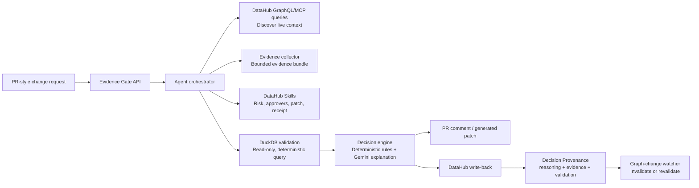

# DataHub Organizational Reasoning

### First workflow: Evidence Gate

## In one sentence

Evidence Gate turns one-time data governance decisions into graph-linked organizational memory that stays trustworthy by automatically invalidating itself when the underlying metadata changes.

```
PR / change request → Evidence Gate → Decision Provenance on DataHub → future agent asks "why?" → graph changes → stale → similar change reuses it as precedent
```

> This isn't a new audit log or a new approvals system. DataHub already knows what's connected. What it doesn't do yet is remember *why* a decision was made, or notice when that reasoning stops being true. Organizational Reasoning is the pattern; Evidence Gate is the first concrete workflow that implements it, for one high-stakes case: a risky schema/metric change.

**Track:** Agents That Do Real Work (also fits Metadata-Aware Code Generation & Development)

## Engineering highlights

- ✅ Deterministic decision engine — rules and validation decide, never the LLM
- ✅ Read-only, allow-listed validation query
- ✅ Real DataHub graph throughout — no mocked lineage in the demo path
- ✅ Decision Provenance written back to the actual asset
- ✅ Automatic invalidation when graph state changes
- ✅ Precedent retrieval across similar changes
- ✅ 39 automated tests, including graceful failure-mode handling

## The problem I'm actually trying to solve

Six months after a migration, anyone can tell you who merged the PR. Almost nobody can tell you what evidence justified it, or whether that reasoning still holds up today. I've seen this play out as a developer myself — a schema gets renamed, three dashboards quietly go stale, and the only trace of "why we thought this was safe" is a Slack message someone can't find anymore.

DataHub already has the graph — lineage, ownership, glossary terms, quality state. Evidence Gate uses that graph to actually check a proposed change before it ships, and then writes the reasoning back onto the asset itself, so the *why* lives in the same place as the *what's connected*, not in a separate system nobody checks.

## What it does

Before a risky schema change, metric redefinition, or quality override ships, Evidence Gate:

- **Reads** DataHub's real context graph — lineage, ownership, glossary terms, quality state — through direct GraphQL/MCP-style queries against DataHub's GMS.
- **Decides** with deterministic rules. No unconstrained LLM call gets to approve or block anything. For governance decisions, approve/block stays deterministic by design.
- **Writes the decision back** onto the affected DataHub asset, so it's queryable the same way anything else on that asset is.
- **Knows when to stop trusting its own past decision** — if something the decision relied on changes later (a glossary link removed, a new failing assertion), it flags the old provenance as stale instead of letting it sit there looking authoritative forever.

## Demo scenario

An engineer proposes renaming `order_total` to `recognized_revenue` in the `order_entry_db.analytics.order_details` Snowflake dataset. This is a real dataset in DataHub's showcase-ecommerce sample data — it's linked to the "Order Total" and "Revenue by Customer Class" glossary terms, and it's consumed downstream by PowerBI, Looker, Tableau, and dbt assets.

I picked this instead of a synthetic example on purpose: `order_total` (gross transaction value) and "recognized revenue" (an accounting concept that typically excludes tax and unfulfilled orders) aren't actually the same number, and the validation step proves it rather than asserting it.

1. Evidence Gate pulls real context for the asset — downstream dashboards, owners, lineage, the glossary definitions, current quality state.
2. It runs a read-only validation query comparing the old and proposed aggregates against fixture order data.
3. It **blocks** the change — the validation shows a 13.16% shift in the aggregate, well past the tolerance — names who needs to sign off, and generates a compatibility patch plus a migration test.
4. It writes a Decision Provenance record onto the DataHub asset: rationale, what was checked, the validation result, risk score, and when it should be revisited.
5. A second, completely separate process asks "why was this blocked?" and gets the answer by reading what's actually stored on DataHub — it doesn't reconstruct or guess at an answer.
6. I simulate one of the underlying conditions changing (removing the glossary link), and the stored decision flips to stale on DataHub itself.
7. A second, similar change request comes in, finds this decision as precedent, and says plainly what still applies and what's different about this new case.

## Architecture



**On Agent Context Kit and Analytics Agent specifically:** I evaluated both directly against this project before deciding not to use them. DataHub's Agent Context Kit (`datahub-agent-context`) exposes `get_lineage`, `get_entities`, and `get_dataset_assertions` — but running these against my local DataHub quickstart, `get_lineage` reads from the search index and returned zero downstream consumers for an asset that direct GraphQL graph traversal shows has real BI dashboard consumers; the search index just wasn't caught up. `get_dataset_assertions` had the same gap. So I kept direct GraphQL queries, which read the graph store rather than the search index.

I also evaluated the standalone Analytics Agent app for the validation step. It's LangGraph-based and generates SQL via an LLM — which is a good fit for open-ended "ask a question" use cases, but a bad fit here: this project's one hard rule is that validation stays deterministic and allow-listed (see below), and LLM-generated SQL is neither. I kept a plain DuckDB query instead.

## What I think is actually new here, and what isn't

I'm not claiming to have invented lineage, audit logs, or approval workflows — DataHub and plenty of other tools already do those well. What I haven't seen elsewhere: tying a specific decision to the exact evidence that justified it, letting that reasoning get reused as precedent for a similar future change, and detecting when the graph state behind an old decision has drifted. Everything in the demo path runs against a real, live DataHub instance — no static JSON standing in for the graph, no mocked lineage.

## Repository layout

```
.
├── README.md
├── LICENSE                  # Apache 2.0
├── SKILL.md                 # Build/execution guide for the coding agent
├── .devcontainer/
│   └── devcontainer.json    # Codespaces config: docker-in-docker, Python
├── src/
│   ├── api/                 # FastAPI orchestrator (Evidence Gate entrypoint)
│   ├── discovery/            # DataHub GraphQL/MCP-style client calls
│   ├── evidence/              # Evidence bundle construction
│   ├── validation/            # Read-only revenue comparison query (DuckDB/fixture)
│   ├── decision/              # Deterministic risk rules + LLM explanation
│   ├── remediation/           # dbt-compatible patch + test generation
│   ├── writeback/              # Decision Provenance write-back to DataHub
│   ├── invalidation/          # Graph-change watcher
│   └── precedent/             # Precedent retrieval + comparison
├── skills/                    # Standalone CLI wrappers around the same logic
│   ├── assess_change_risk/
│   ├── create_decision_provenance/
│   ├── find_similar_precedents/
│   └── invalidate_stale_provenance/
├── oss-contribution-draft/    # Generalized skill prepared for datahub-skills
│   └── datahub-decision-provenance/
├── examples/                  # Sample schema diff, evidence bundle, blocked
│   │                           decision, generated patch, provenance payload
├── tests/                     # Unit tests: risk scoring, validation, write-back,
│   │                           invalidation, precedent comparison
├── fixtures/                   # showcase-ecommerce datapack + revenue fixture
└── docs/
    ├── setup.md
    ├── troubleshooting.md
    ├── test-report.md
    ├── demo-script.md
    └── oss-contribution.md
```

## Running it yourself

I built this inside a **GitHub Codespace**, not on my own machine — my laptop doesn't have the RAM to run DataHub's Docker stack comfortably, and Codespaces' free tier (2 cores, 8GB RAM, 32GB storage) covers it without needing to install Docker locally at all. The devcontainer config in this repo brings up Docker-in-Docker automatically.

```bash
# 0. Open this repo in a Codespace (GitHub UI: Code -> Codespaces -> Create
#    codespace on main). The .devcontainer/devcontainer.json config brings
#    up Docker-in-Docker automatically — no manual Docker install needed.

# 1. Start DataHub and load sample data (inside the codespace terminal)
datahub docker quickstart
python scripts/load_showcase_ecommerce.py

# 2. Install dependencies
python -m venv .venv && source .venv/bin/activate
pip install -r requirements.txt

# 3. Configure environment
cp .env.example .env   # set DATAHUB_GMS_URL, DATAHUB_MCP_URL, GEMINI_API_KEY

# 4. Run the API
uvicorn src.api.main:app --reload

# 5. Submit the included fixture change request
python scripts/submit_change.py --fixture fixtures/net_revenue_rename.json

# 6. Inspect the Decision Provenance written back to DataHub
# Codespaces auto-forwards port 9002 - open the forwarded URL from the
# "Ports" tab, or use the PORTS panel link. Find the affected asset there.
```

Full environment variables, teardown steps, port-forwarding notes, and troubleshooting live in `docs/setup.md` and `docs/troubleshooting.md`.

If you're on the free Codespaces tier: stop the codespace (not just close the tab) when you're done for the day — a stopped codespace only costs a small amount of storage, not compute hours.

## What this deliberately doesn't do

- It doesn't auto-merge or auto-deploy anything. An `approved` result still means the listed people need to actually sign off.
- The model never makes the approve/block call by itself — that stays rule-based. The model explains evidence and drafts remediation, nothing more.
- Validation only runs against fixture/sample data, read-only, and only the one pre-registered comparison query — no arbitrary query generation.
- This covers one change type end-to-end (a revenue field rename) rather than half-covering many. I'd rather have one path that's actually solid than five that are theoretical.

## Safety model

Short version of how this stays safe to run against a real DataHub instance:

- **Read scope**: discovery queries (lineage, glossary, ownership, quality) are read-only against DataHub's graph. Nothing here mutates an asset's structural metadata.
- **Validation scope**: the one compatibility query is allow-listed and hardcoded — it's not an LLM generating arbitrary SQL against anything, and it only ever runs against local fixture data, never production.
- **Write scope**: the only thing this system writes anywhere is the Decision Provenance record itself (custom properties, an institutional memory link, and an incident if blocked) — never a schema change, never a merge, never a deploy.
- **Human-in-the-loop by design**: `approved` names required approvers; it doesn't act as their approval. A blocked change stays blocked until a human actually does something about it.
- **LLM containment**: Gemini only ever receives already-computed facts (risk score, which rules fired, the validation delta) and turns them into readable prose or drafts a migration patch — it has no path to change the decision itself. This is enforced with an explicit hallucination check that rejects LLM output referencing signals that didn't actually fire, falling back to a template if it does.

## Examples

`examples/` has a full walkthrough without needing to run anything: the input schema diff, the evidence bundle, the blocked decision output, the generated dbt patch, and the actual provenance payload written back to DataHub.

## Open-source contribution

I pulled the write-back/precedent/staleness logic out into a generalized skill for `datahub-project/datahub-skills` and opened a real pull request from my own account:

https://github.com/datahub-project/datahub-skills/pull/71

See `docs/oss-contribution.md` for more detail on what it covers and why.

## License

Apache 2.0 — see [LICENSE](./LICENSE).
