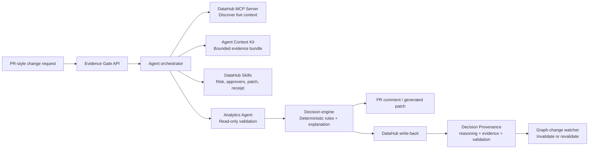

# DataHub Organizational Reasoning — Evidence Gate

> We do not claim to invent audit logs, approvals, or decision receipts. We make organizational reasoning operational for data teams: graph-linked Decision Provenance that can be replayed, reused as precedent, and invalidated when the context graph changes.

**Track:** Agents That Do Real Work (secondary fit: Metadata-Aware Code Generation & Development)

## What this is

Before a risky schema change, model promotion, quality override, or metric update ships, **Evidence Gate** builds a replayable evidence packet from DataHub, runs deterministic validation, recommends approve / block / needs-review, and writes a **Decision Provenance** artifact back onto the affected DataHub assets — so a later engineer or agent can ask "why was this approved?" and get the real answer instead of a guess.

- **It reads** DataHub's context graph: lineage, ownership, glossary terms, policies, quality state — via the MCP Server and Agent Context Kit.
- **It decides** with deterministic rules (never an unconstrained LLM approval).
- **It writes back**: the reasoning becomes part of the graph, not a row in a separate audit log.
- **It knows when to stop trusting itself**: if the graph state that justified a decision later changes, the provenance is marked stale and revalidation is required.

## Why it matters

Six months after a migration, most teams can answer "who merged this?" No team can answer "what evidence, definition, and approval justified it, and does that reasoning still hold today?" Evidence Gate makes DataHub the system of record for *why*, not just *what's connected*.

## Demo scenario

An engineer proposes renaming the business-critical `order_total` field to `recognized_revenue` in the `order_entry_db.analytics.order_details` Snowflake dataset — a real dbt/Snowflake-style transformation in the showcase-ecommerce sample data, linked to the "Order Total" and "Revenue by Customer Class" glossary terms and consumed downstream by PowerBI, Looker, Tableau, and dbt assets.

1. Evidence Gate discovers real graph context: downstream dashboards, owners, lineage, the `Revenue` glossary definition, current quality state.
2. It runs a read-only validation query comparing old vs. proposed revenue aggregates against fixture data.
3. It **blocks** the change (validation shows a 4.3% metric shift), names the required approver (Finance Analytics owner), and generates a compatibility patch + test.
4. It writes a Decision Provenance artifact to the affected DataHub asset: rationale, graph snapshot, evidence checked, validation result, risk score, revalidation expiry.
5. A second, independent agent interaction asks "why was this migration blocked?" and retrieves the stored reasoning from DataHub — it does not improvise an answer.
6. A referenced policy/lineage/schema condition changes → the provenance is marked `stale`, revalidation is required.
7. A similar future rename retrieves this provenance as precedent and explicitly shows what still applies and what changed.

## Architecture



## What's genuinely new here

DataHub already tells us what is connected. This does not reinvent lineage, audit logs, or approval gates. It links a decision to the exact assets, evidence, and validation that justified it; lets that reasoning be replayed and reused as precedent; and detects when the graph state behind a past decision has changed. Nothing here is a static JSON graph or a mocked lineage stub — every graph read and write in the demo path hits a real, running DataHub instance.

## Repository layout

```
.
├── README.md
├── LICENSE                  # Apache 2.0
├── SKILL.md                 # Build/execution guide for the coding agent
├── .devcontainer/
│   └── devcontainer.json    # Codespaces config: docker-in-docker, Python
├── src/
│   ├── api/                 # FastAPI orchestrator (Evidence Gate entrypoint)
│   ├── discovery/            # DataHub MCP / ACK client calls
│   ├── evidence/              # Evidence bundle construction
│   ├── validation/            # Read-only revenue comparison query (DuckDB/fixture)
│   ├── decision/              # Deterministic risk rules + LLM explanation
│   ├── remediation/           # dbt-compatible patch + test generation
│   ├── writeback/              # Decision Provenance write-back to DataHub
│   ├── invalidation/          # Graph-change watcher
│   └── precedent/             # Precedent retrieval + comparison
├── skills/                    # Published DataHub Skills (OSS contribution)
│   ├── assess_change_risk/
│   ├── create_decision_provenance/
│   ├── find_similar_precedents/
│   └── invalidate_stale_provenance/
├── examples/                  # Sample schema diff, evidence bundle, blocked
│   │                           decision, generated patch, provenance payload
├── tests/                     # Unit tests: risk scoring, validation, write-back,
│   │                           invalidation, precedent comparison
├── fixtures/                   # showcase-ecommerce datapack + revenue fixture
└── docs/
    ├── setup.md
    └── troubleshooting.md
```

## Quickstart

This project is developed inside **GitHub Codespaces**, not on a local
machine. DataHub's Quickstart needs Docker + 8GB RAM; Codespaces provides
both (a 2-core/8GB/32GB machine on the free tier) with Docker already
available via the `docker-in-docker` devcontainer feature — nothing to
install locally beyond a browser or VS Code.

```bash
# 0. Open this repo in a Codespace (GitHub UI: Code -> Codespaces -> Create
#    codespace on main). The .devcontainer/devcontainer.json config brings
#    up Docker-in-Docker automatically — no manual Docker install needed.

# 1. Start DataHub and load sample data (inside the codespace terminal)
datahub docker quickstart
python scripts/load_showcase_ecommerce.py

# 2. Install dependencies
python -m venv .venv && source .venv/bin/activate
pip install -r requirements.txt

# 3. Configure environment
cp .env.example .env   # set DATAHUB_GMS_URL, DATAHUB_MCP_URL, GEMINI_API_KEY

# 4. Run the API
uvicorn src.api.main:app --reload

# 5. Submit the included fixture change request
python scripts/submit_change.py --fixture fixtures/net_revenue_rename.json

# 6. Inspect the Decision Provenance written back to DataHub
# Codespaces auto-forwards port 9002 - open the forwarded URL from the
# "Ports" tab, or use the PORTS panel link. Find the affected asset there.
```

Full environment variables, teardown steps, Codespaces port-forwarding
notes, and a DataHub/MCP connectivity troubleshooting section live in
`docs/setup.md` and `docs/troubleshooting.md`.

**Cost/time note:** the free Codespaces tier gives 60 hours/month on a
2-core machine. Stop the codespace (don't just close the tab) when you're
not actively building — a stopped codespace only bills small storage, not
compute hours.

## What this does NOT do

- It does **not** auto-merge or auto-deploy any change. Every `approved` result still requires the listed human approvers.
- All approve/block decisions are deterministic and rule-backed. The LLM only explains evidence and drafts remediation — it never unilaterally approves anything.
- Validation is read-only and allow-listed against fixture/sample data only.
- This MVP covers exactly one change type (revenue field rename) end-to-end rather than partial coverage of many.

## Examples

See `examples/` for a full walkthrough without needing to run the project: the input schema diff, the assembled evidence bundle, the blocked decision output, the generated dbt compatibility patch, and the written-back Decision Provenance payload.

## Open-source contribution

This project publishes four reusable DataHub Skills (`skills/`) and includes an upstream contribution to DataHub — see `docs/oss-contribution.md` for the linked PR/issue.

## License

Apache 2.0 — see [LICENSE](./LICENSE).
